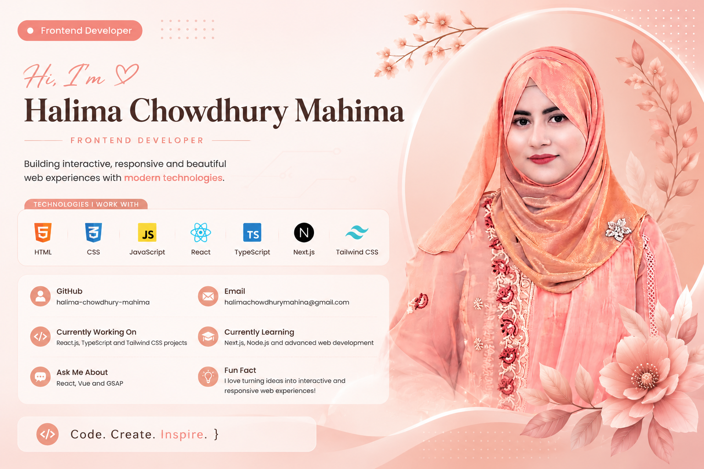

<p align="center">
  
</p>


# Hi 👋, I'm Halima Chowdhury Mahima

### 🌟 *Aspiring Web Developer* | *Passionate Learner*

<p align="center">
  
</p>

---

## 🙋‍♀️ About Me

* 🌱 Currently learning **Node.js, React & Next.js**
* 💻 Passionate about **Web Development**
* 🎨 Familiar with **Figma & Adobe Photoshop**
* 🚀 I enjoy learning new technologies and building projects
* 🎯 My goal is to become a skilled **Full Stack Web Developer**
* 📚 Always learning and improving my skills

---

# 🛠️ Tech Stack & Skills

### 🌐 Web Development

<p>


</p>

### ⚛️ Currently Learning

<p>


</p>

### 🎨 Design Tools

<p>


</p>

---

# 💻 My Projects

### 🌟 Web Development Journey

I am continuously building projects and improving my skills in:

* 🌐 Responsive Web Design
* 🎨 Modern UI Design
* 💻 JavaScript Applications
* ⚛️ React Projects
* ▲ Next.js Applications

🚀 **More exciting projects coming soon!**

---

# 📊 GitHub Stats

<p align="center">  </p>

<p align="center">  </p>

<p align="center">  </p>

---

# 🌱 My Learning Journey

```text
HTML          ██████████  ✓
CSS           ██████████  ✓
JavaScript    ██████████  ✓
ES6           ██████████  ✓
Tailwind CSS  █████████░  ✓
Node.js       ██████░░░░  Learning
React         ██████░░░░  Learning
Next.js       █████░░░░░  Learning
Figma         █████████░  ✓
Photoshop     █████████░  ✓
```

---

# 🤝 Connect With Me

<p>

<a href="mailto:halimachowdhurymahina@gmail.com">

</a>

<a href="https://github.com/halima-chowdhury-mahima">

</a>

</p>

📧 **Email:** [halimachowdhurymahina@gmail.com](mailto:halimachowdhurymahina@gmail.com)

---

### ✨ "Keep learning, keep building, and never stop improving."

⭐ **Feel free to explore my repositories and follow my coding journey!**
