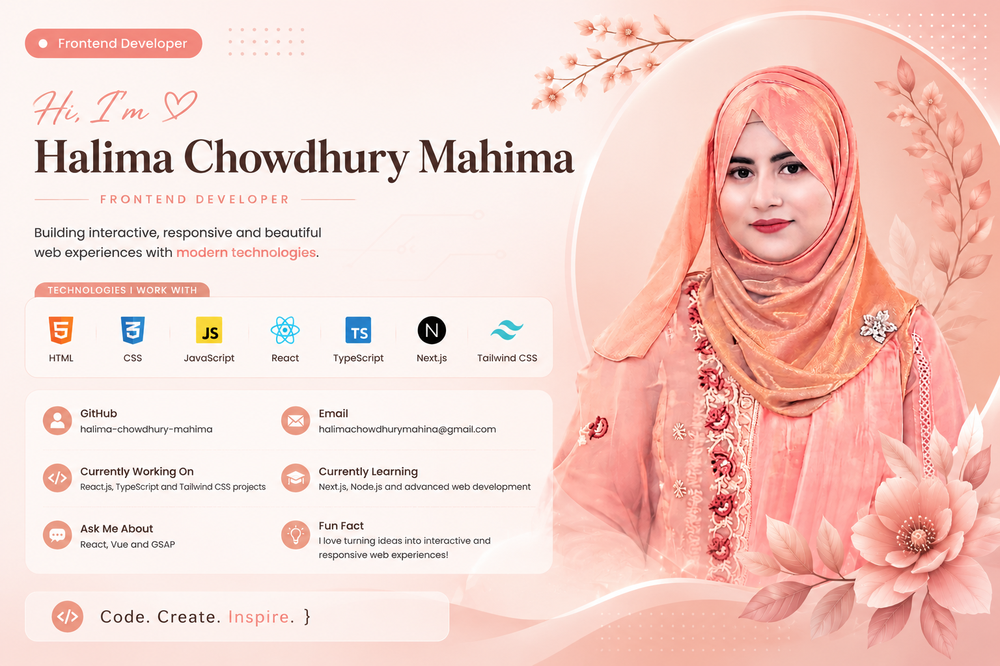

<p align="center">
  
</p>


<h1 align="center">Hi 👋, I'm Halima Chowdhury Mahima</h1>

<h3 align="center">💻 Full Stack Web Developer | 🚀 Passionate Learner | ✨ Building Modern Web Experiences</h3>

<p align="center">
  
</p>

---

## 👩‍💻 About Me

- 💻 Full Stack Web Developer focused on building modern and responsive web applications
- ⚛️ Working with **React, Next.js, JavaScript & TypeScript**
- 🌱 Expanding my knowledge in **Node.js and Backend Development**
- 🎨 Experienced with **Tailwind CSS, Figma & Adobe Photoshop**
- 🚀 I enjoy transforming ideas into functional and user-friendly digital experiences
- 🧠 Always interested in learning new technologies and improving my development skills
- 🎯 My goal is to build scalable, professional and impactful full-stack applications


- 📍 Based in **Dhaka, Bangladesh**

---

## 🛠️ Tech Stack & Skills

### 🌐 Frontend Development

<p>

<a href="https://developer.mozilla.org/en-US/docs/Web/HTML" target="_blank">
  
</a>

<a href="https://developer.mozilla.org/en-US/docs/Web/CSS" target="_blank">
  
</a>

<a href="https://developer.mozilla.org/en-US/docs/Web/JavaScript" target="_blank">
  
</a>

<a href="https://www.typescriptlang.org/" target="_blank">
  
</a>

<a href="https://262.ecma-international.org/6.0/" target="_blank">
  
</a>

<a href="https://react.dev/" target="_blank">
  
</a>

<a href="https://nextjs.org/" target="_blank">
  
</a>

<a href="https://tailwindcss.com/" target="_blank">
  
</a>

</p>

### ⚙️ Backend & Development

<p>

<a href="https://nodejs.org/" target="_blank">
  
</a>

<a href="https://git-scm.com/" target="_blank">
  
</a>

<a href="https://github.com/halima-chowdhury-mahima" target="_blank">
  
</a>

<a href="https://vercel.com/" target="_blank">
  
</a>

</p>

### 🎨 Design Tools

<p>

<a href="https://www.figma.com/" target="_blank">
  
</a>

<a href="https://www.adobe.com/products/photoshop.html" target="_blank">
  
</a>

</p>

---

# 🚀 Featured Projects

## 🏋️ FitLog

A modern fitness workout tracking application built with **Next.js, TypeScript and Tailwind CSS**.

### ✨ Features

- Workout library
- Dynamic workout details
- Today's workout plan
- Save and remove workouts
- Mark workouts as completed
- Workout duration sorting
- Responsive design
- Toast notifications
- Loading and 404 pages

### 🛠️ Technologies

`Next.js` `TypeScript` `Tailwind CSS` `DaisyUI` `React`


### 🔗 Links

🌐 [Live Demo](https://fit-log-chi.vercel.app/)  
💻 [GitHub Repository](https://github.com/halima-chowdhury-mahima/Fit-log)

---

## 💻 Dev Stack

A responsive developer-focused web application built with modern frontend technologies.

### ✨ Features

- Modern responsive UI
- Developer technology cards
- Add-to-stack functionality
- Toast notifications
- JSON-based dynamic data
- Mobile-friendly design

### 🛠️ Technologies

`React` `TypeScript` `Tailwind CSS` `DaisyUI`


### 🔗 Links

🌐 [Live Demo](https://dev-stack-sigma.vercel.app/)
💻 [GitHub Repository](https://github.com/halima-chowdhury-mahima/Dev-stack)

---

## 🌐 Personal Portfolio

A modern and responsive personal portfolio website showcasing my skills, projects, experience and contact information.

### ✨ Features

- Professional personal introduction
- Skills and technology showcase
- Featured project sections
- Responsive design for mobile, tablet and desktop
- Contact and social media links
- Clean and modern user interface

### 🛠️ Technologies

`HTML` `CSS` `JavaScript`

### 🔗 Links

🌐 [Live Demo](https://halima-chowdhury-mahima.github.io/My-Resume/)
💻 [GitHub Repository](https://github.com/halima-chowdhury-mahima/My-Resume)

---

# 📊 GitHub Statistics

<p align="center">
  
  
</p>

<p align="center">
  
</p>

---

# 📚 My Development Journey

```text
HTML          ██████████
CSS           ██████████
JavaScript    ██████████
ES6           ██████████
TypeScript    █████████░
Tailwind CSS  █████████░
React         ████████░░
Next.js       ████████░░
Node.js       ██████░░░░
Figma         █████████░
Photoshop     █████████░
```

---

# 🌐 Social & Portfolio Links

<p align="center">

<a href="https://www.linkedin.com/in/halima-chowdhury-mahima-661084433/">
  
</a>

<a href="https://halima-chowdhury-mahima.github.io/My-Resume/">
  
</a>

<a href="https://github.com/halima-chowdhury-mahima">
  
</a>

<a href="mailto:halimachowdhurymahina@gmail.com">
  
</a>

</p>

<p align="center">
  <b>📧 Email:</b> 
  <a href="mailto:halimachowdhurymahina@gmail.com">
    halimachowdhurymahina@gmail.com
  </a>
</p>

---

# 🤝 Let's Connect

I'm always interested in connecting with developers, learning new technologies and working on meaningful projects.

If you would like to collaborate, discuss a project or simply connect, feel free to reach out through my social links.

---

<p align="center">
  <i>✨ "Keep learning, keep building, and never stop improving."</i>
</p>

<p align="center">
  ⭐ Feel free to explore my repositories and follow my development journey!
</p>

<p align="center">
  💙 Thanks for visiting my GitHub Profile!
</p>

